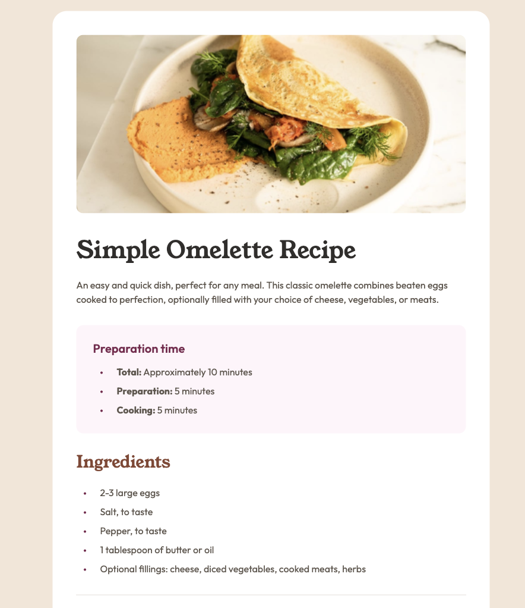
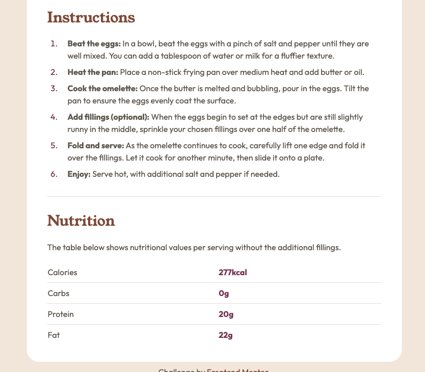

# Frontend Mentor - Recipe page solution

This is a solution to the [Recipe page challenge on Frontend Mentor](https://www.frontendmentor.io/challenges/recipe-page-KiTsR8QQKm). Frontend Mentor challenges help you improve your coding skills by building realistic projects.

## Table of contents

- [Overview](#overview)
  - [The challenge](#the-challenge)
  - [Screenshot](#screenshot)
  - [Links](#links)
- [My process](#my-process)
  - [Built with](#built-with)
  - [What I learned](#what-i-learned)
  - [Continued development](#continued-development)
  - [Useful resources](#useful-resources)
- [Author](#author)
- [Acknowledgments](#acknowledgments)

## Overview

### Screenshot




### Links

- Solution URL: [Frontend Mentor](https://your-solution-url.com)
- Live Site URL: [Live](https://fementor-recipe-page.vercel.app/)

## My process

### Built with

- Semantic HTML5 markup
- CSS custom properties
- Mobile-first workflow

### What I learned

In this challenge I learned to use the ::marker pseudo-element for styling list bullets and numbers.

```css
.prep-time__list-item::marker,
.ingredients__list-item::marker {
  color: var(--dark-raspberry);
  font-size: var(--fs-xs);
}

.instructions__list-item::marker {
  color: var(--dark-raspberry);
}
```

I also further explored using CSS custom properties in tandem with math functions to create dynamically sized text and spacing. Some examples of this:

```css
/* border radii */
--radius-1: 0.75rem;
--radius-2: 1.5rem;
--dynamic-radius-1: max(0px, min(var(--radius-1), (100% - 400px) * 9999)) / var(--radius-1);
--dynamic-radius-2: max(0px, min(var(--radius-2), (100% - 400px) * 9999)) / var(--radius-2);

main {
  padding-top: var(--padding-top-main);
  background-color: var(--clr-bg-main);
  width: var(--width-main);
  overflow: hidden;
  border-radius: var(--dynamic-radius-2);
}

.img-wrapper {
  border-radius: var(--dynamic-radius-1);
  width: min(100%, 41rem);
  margin: 0 auto;
  overflow: hidden;
}
```

### Continued development

I look forward to further practice with the power of `calc()`, `min()`, `max()`, and `clamp()` in creating responsive layouts and components.

### Useful resources

- [Conditional Border Radius in CSS](https://ishadeed.com/article/conditional-border-radius/) - This article perfectly explains the what is actually happening when using functions for dynamic border radius. This is a confusing concept but I understand it 10x better now.

## Author

- Github - [@jasoneczek](https://www.github.com/jasoneczek)
- Frontend Mentor - [@jasoneczek](https://www.frontendmentor.io/profile/jasoneczek)

## Acknowledgments

Thank you [Frontend Mentor](https://www.frontendmentor.io) for creating this challenge.
